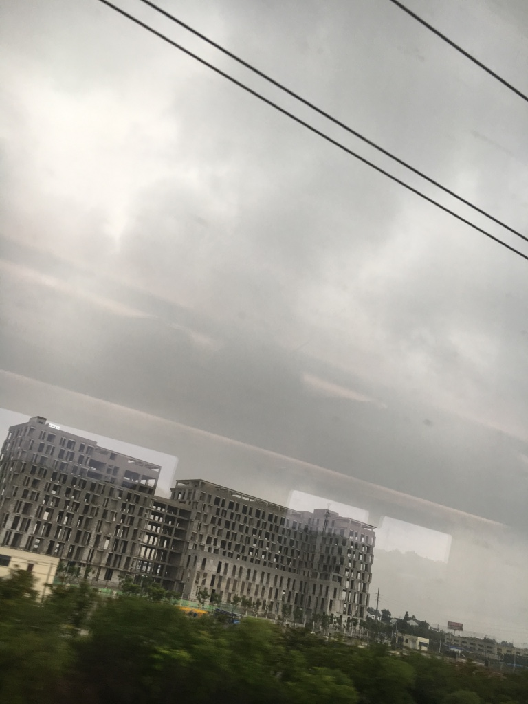
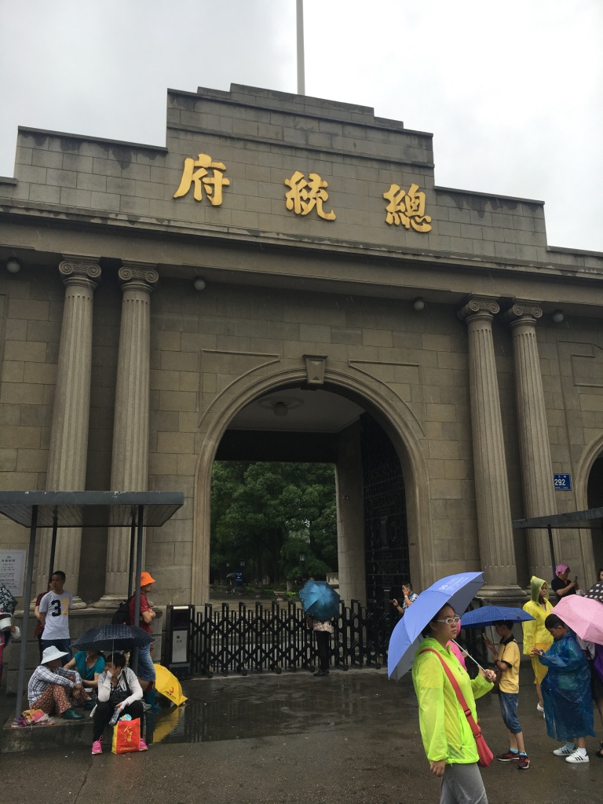
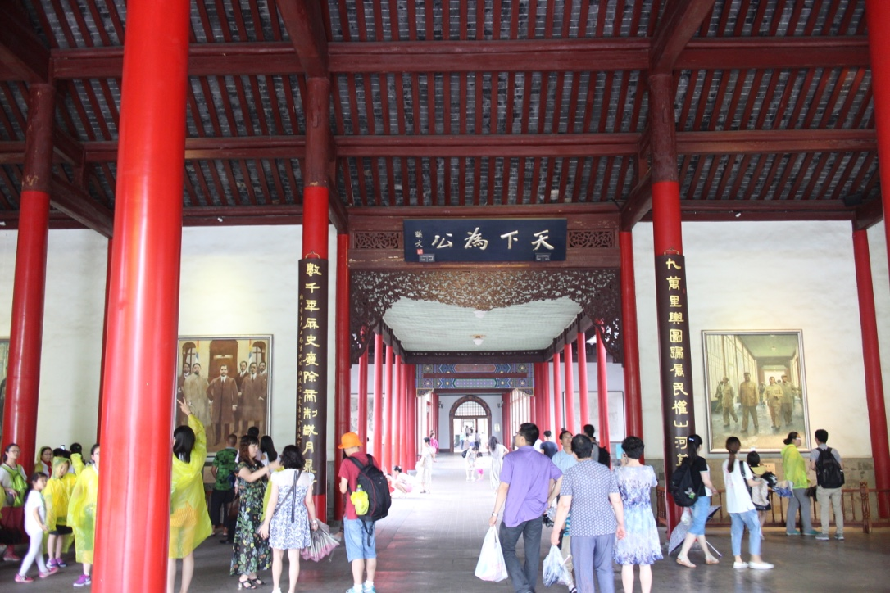
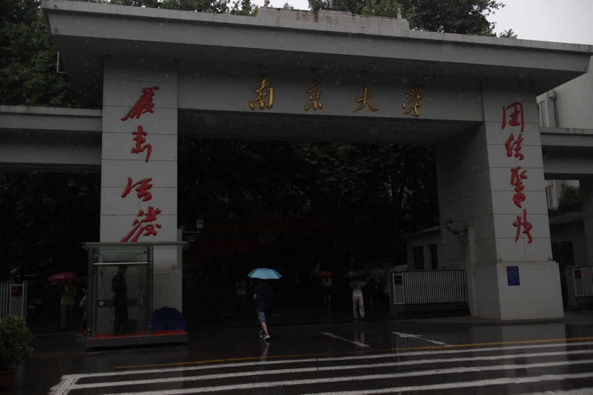
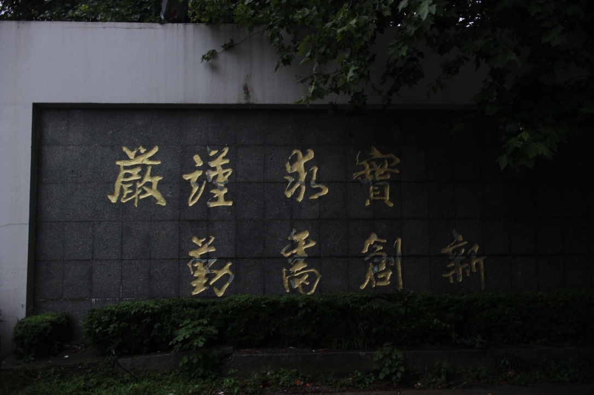
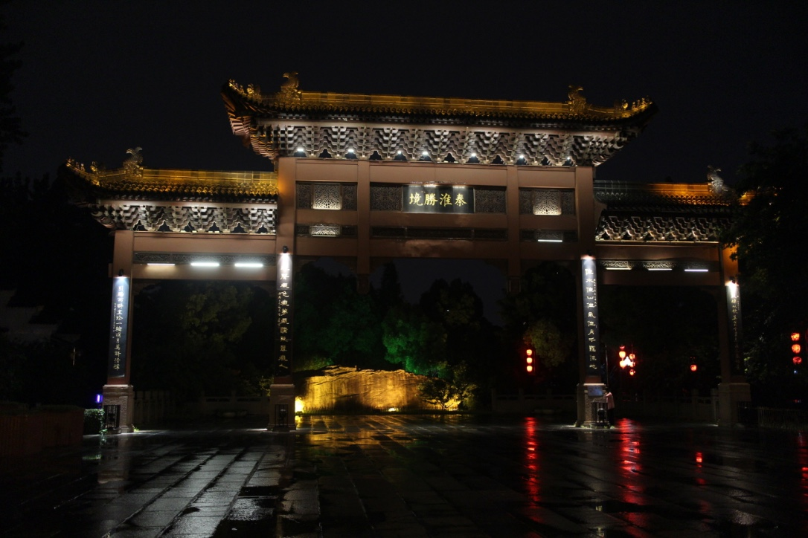
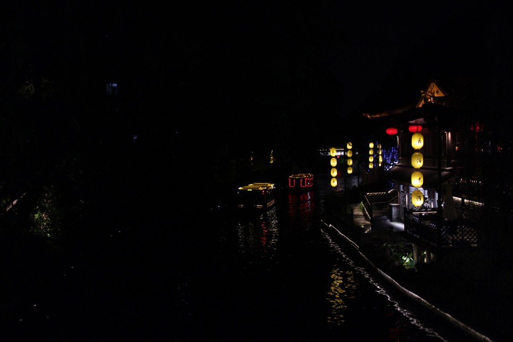
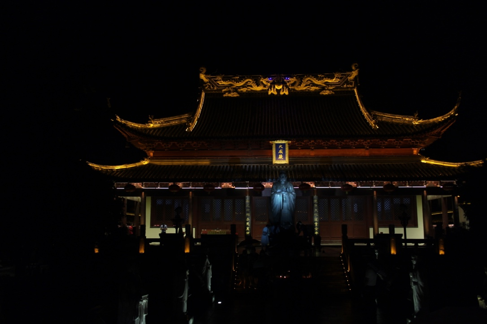
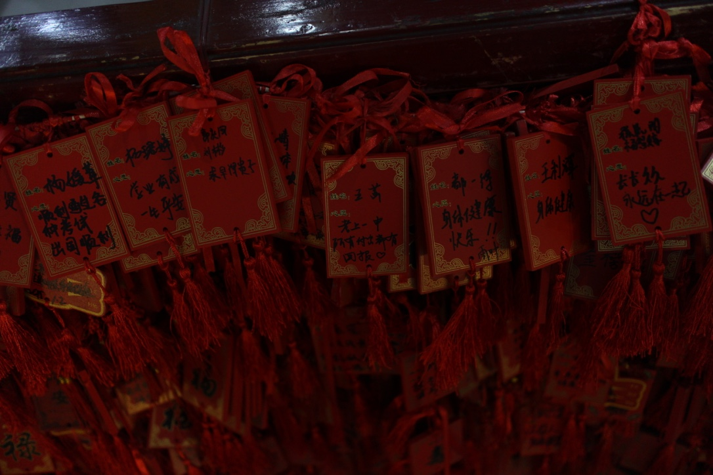
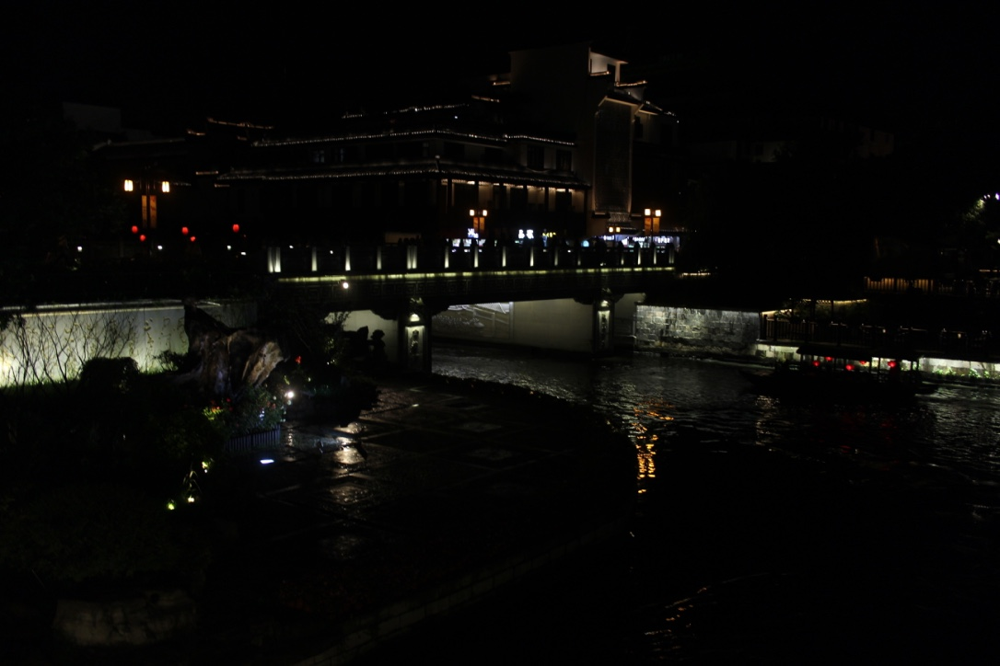

南京
==============
        江南行
                    －－浅诺
        万里无云是虹桥，
        江南路上阴雨天。
        油伞问路总统府，
        缅怀当年将帅才。
        学子出游必大学，
        首行学府是南大。
        卸负客栈休整罢，
        随流客船秦淮河。
        双龙戏珠岸堤旁，
        独自行拜夫子庙。
        归途偶遇佳人伴，
        寂夜荒路也笑语。
        清晨酒醒中山陵，
        徒步登高祭逸仙。
        迷途游车明孝陵，
        太祖隐墓显神奇。
        远行为是紫霞湖，
        最爱三国仲谋馆。
        神像道上谋寺途，
        古鸡鸣寺诚请佛。
        傍晚时分玄武湖，
        一串玉米伴风筝。
        吃货万里狮子街，
        归来却是烤猪蹄。
        路途已是四万步，
        一壶清酒梦乡醉。
        当年日寇大屠杀，
        游者岂能面尤笑？
        必胜馆内禁留影，
        脸上国旗释情怀。
        行路难涉雨花台，
        游览车上识英雄。
        不虚此行南师大，
        新旧校园青春情。
### 时间：2016-06-24
### 旅程：
        上海泗泾出发－>上海虹桥－>南京南－>总统府->南京大学－>夫子庙附近酒店入住->夫子庙－>酒店休闲
### 消费明细:
项目|类型|费用
-------------------|--------|--------------
上海泗泾出发－>上海虹桥 | 地铁+公交 | 5元
上海虹桥－>南京南 |高铁 |134.5元
南京南－>总统府 | 地铁＋公交 | 5元
总统府 | 门票 | 40元
总统府－>南京大学 | 公交 | 2元
南京大学－>酒店 | 公交 | 2元
酒店 | 住宿两晚 | 379元
夫子庙 | 门票 | 30元
合计| | 597.5元

#### 上海虹桥
        每一个旅途，都要有一定的计划，随心所欲，说走就走的基本很难玩到什么。除非你有很多时间，很多金钱。
        旅途有风险，买票需谨慎。到了上海虹桥我特么发现买的票是上海站出发的。
        我累了我痛了 
        我对你的爱已经疲惫了 
        我醉了我哭了 
        我被你的爱彻底伤透了 
        

        万里无云是虹桥，江南路上阴雨天。

        油伞问路总统府，缅怀当年将帅才。

        学子出游必大学，首行学府是南大。
        

        卸负客栈休整罢，随流客船秦淮河。
        

        
        双龙戏珠岸堤旁，独自行拜夫子庙。
        

        归途偶遇佳人伴，寂夜荒路也笑语。
        

